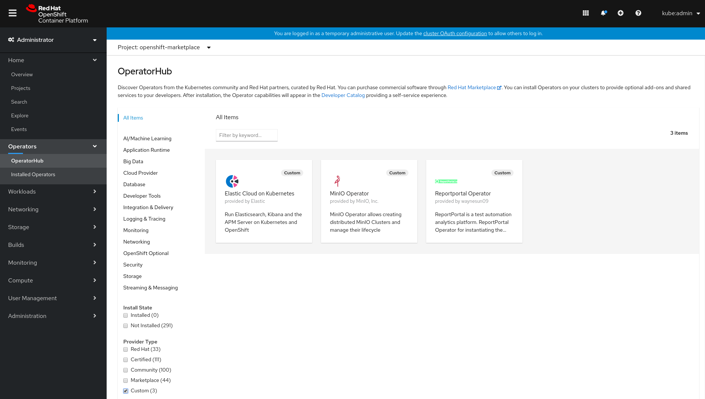
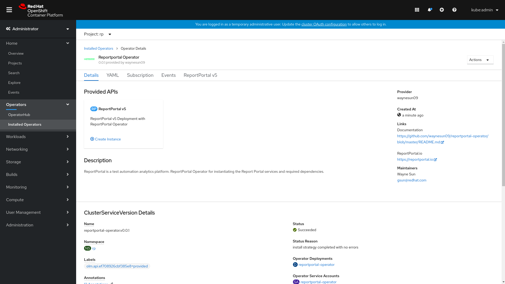
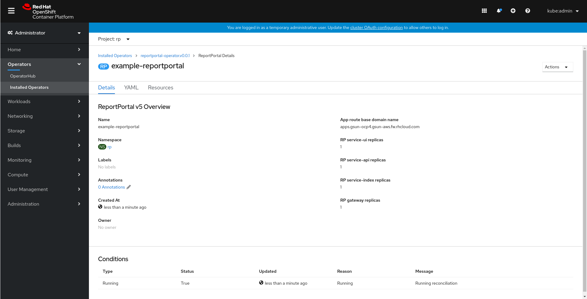

# Reportportal Operator

Umbrella Operator for ReportPortal and dependency services.

This repo is built with Operator SDK and Ansible role.

What services are included:

    - Report Portal v5.2
    - PostgreSQL
    - Elasticsearch
    - RabbitMQ
    - Minio

By default all services will be installed in the same namespace and managed by the operator.

## Requirements

- OpenShift Container Platform 4.x
- operator-sdk
- operator-registry opm client
- oc client

## Deploy without OLM

User could deploy with crd and create CR instance.

Create the CRD:

    $ oc create -f deploy/crds/rp5.reportportal.io_reportportals_crd.yaml

    $ oc get crd |grep reportportal
    reportportals.rp5.reportportal.io                           2020-04-23T21:35:24Z

Deploy the Operator:

    $ oc create -f deploy/service_account.yaml
    $ oc create -f deploy/role.yaml
    $ oc create -f deploy/role_bindg.yaml
    $ oc create -f deploy/operator.yaml

Prepare and update the CR yaml file:

    $ cp deploy/crds/rp5.reportportal.io_v1_reportportal_cr.yaml cr_example.yaml

    Update the CR file with the parameters

    $ vim cr_example.yaml
    apiVersion: rp5.reportportal.io/v1
    kind: ReportPortal
    metadata:
      name: example-reportportal
    spec:
      # You cluster default router hostname
      app_domain: apps.test-example.com
      ui_replicas: 1
      api_replicas: 1
      api_image: quay.io/waynesun09/service-api:5.3.0-rootless
      uat_image: reportportal/service-authorization:5.3.0
      index_replicas: 1
      gateway_replicas: 1
      enable_pg_restic_backup: yes
      pg_restic_s3_bucket_init: yes
      pg_s3_bucket_name: pgbackup-123123
      pg_restic_password: rp_user
      es_s3_backup_dir: s3_backup
      es_snapshot_bucket: es-snapshot-123123
      es_backup_schedule: '@daily'

With the parameters, you could input your cluster router host name for app_domain which will be used to create your app route name.
And also replicas for RP services components. All parameters descriptions could be in the `roles/reportportal/README.md`

Create new CR instance:

    $ oc create -f cr_example.yaml

    $ oc get ReportPortal
    NAME                   AGE
    example-reportportal   1m

Check the deploy:

    $ oc get pods
    reportportal-operator-848ff6fdd-svfj4   2/2     Running     2          3m

    Check operator logs with progress
    $ oc logs reportportal-operator-848ff6fdd-svfj4 -c operator -f

If found any error or warning, deploy might have failed which need be addressed accordingly.

If you have specified the app_domain in your example, the ReportPortal instance should be available after all services have started and could be assess at:

    https://reportportal-{{ your_namespace }}.{{ app_domain }}

## Deploy with OperatorHub GUI

Check the doc [Using the index with Operator Lifecycle Manager](https://github.com/operator-framework/operator-registry#using-the-index-with-operator-lifecycle-manager)

The OLM operator bundle have been added to registry index image: https://quay.io/waynesun09/wayne-index

### Create the CatalogSource

Prepare a catalog source yaml:

    $ cat catalog-source.yaml
    apiVersion: operators.coreos.com/v1
    kind: CatalogSource
    metadata:
      name: wayne-manifests
      namespace: openshift-marketplace
    spec:
      sourceType: grpc
      image: quay.io/waynesun09/wayne-index:1.0.2

In the OperatorHub choose openshift-marketplace namespace and select Provider type as Custom.

Select "Reportportal Operator" and install it, choose a specific namespace or default to install to all.

Once the Reportportal Operator is available in the Installed Operators page, select Reportportal Operator and select ReportPortal v5 under Provided APIs with Create instance.

Update the app_domain to your cluster default apps sub domain address. Then press Create.

If you want deploy via CLI, check [Deploy with OLM via CLI](docs/deploy_cli.md)

## Development

Check [Development Doc](docs/development.md)

## CI

The Github Action will pull operator-testing image and run operator.verify command to validate with CSV and CRD files change.
