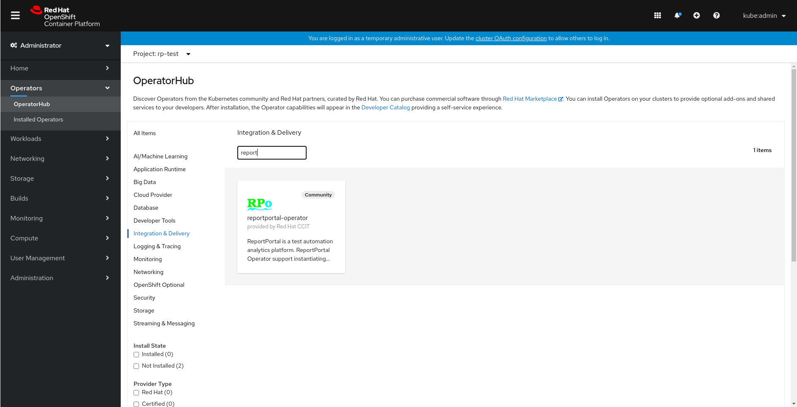
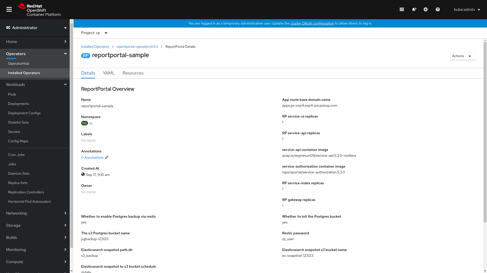

</img>

# Reportportal Operator

Umbrella Operator for ReportPortal and dependency services.

This repo is built with Operator SDK and Ansible role.

What services are included:

    - Report Portal v5.3
    - PostgreSQL
    - Elasticsearch
    - RabbitMQ
    - Minio

By default all services will be installed in the same namespace and managed by the operator.

Data backup support backup PostgreSQL WAL archive and Elasticsearch snapshot to Minio S3, recovery from the s3 WAL archive and restore from Elasticsearch snapshot are supported.

## Requirements

- OpenShift Container Platform 4.x
- operator-sdk
- operator-registry opm client
- oc client
- kustomize

## Deploy with OperatorHub GUI

ReportPortal Operator has been added into [Community Operators](https://github.com/operator-framework/community-operators), now it could be found under OperatorHub in OCP and OKD.

In the OperatorHub select `Integration & Delivery` for category, then in the search box input `reportportal`, the operator will be the first choice.

Select "Reportportal Operator" and install it, choose a specific namespace or default to install to all.

Once the Reportportal Operator is available in the Installed Operators page, select Reportportal Operator and select ReportPortal v5 under Provided APIs with Create instance.

Update the `app_domain` to your cluster default apps sub domain address. Then could press Create and using default values for the rest parameters.

**Note:**: If you need access your internal LDAP, JIRA services etc., you might need to replace the `service-api` and `uat` images with self built ones that include your internal CA certs installed.

If you want deploy via CLI, check [Deploy with CLI](docs/deploy_cli.md)

## Minio S3 Gateway

Minio is one of the dependencies for RP services, [New in 0.0.8] the S3 Gateway setting are exposed on the ReportPortal CRD and CR.

Users could specify the S3 storage with Minio Gateway for RP data, before 0.0.8 the data is stored on minio local PVC storage.

To enable Minio S3 Gateway, update following parameters when create ReportPortal CR:

    s3_enabled: true                  <-- Set to true
    accesskey:                        <-- S3 accesskey
    secretkey:                        <-- S3 secretkey
    s3_endpoint:                      <-- S3 endpoint, default to None for AWS S3
    bucket_prefix:                    <-- Unique prefix name, e.g. unique-s3-bucket-09a7b9-, to identify different RP data
    default_bucket_name:              <-- The s3 bucket name to be created
    integration_salt_path:            <-- Unique s3 bucket name for uat and api salt to avoid name collision

**Note:**: Currently RP DO NOT SUPPORT using existing buckets, so new buckets will be created for new instances

The PostgreSQL WAL archive and Elasticsearch snapshots will also use the same bucket_prefix and create new buckets on S3 target to store the backup data.

## Data backup and restore

The Report Portal v5 data backup and restore in the operator include two parts, PostgreSQL database data and Elasticsearch index data. The Operator support automatically data backup and restore for both.

### PostgreSQL database WAL archiving and recovery

The Operator supports PostgreSQL WAL archiving and recovery point-in-time via Minio S3 using restic.

#### WAL archiving

When deploy Report Portal v5 instance, make sure `enable_pg_restic_backup` option is set as `yes`, then the WAL archiving will be enabled when initiate the database, the WAL archive data will be automatically backed up to S3 storage via Minio using restic command.

So following restic related parameters also need be set if enable PG restic backup:

    pg_restic_s3_bucket_init: yes
    pg_s3_bucket_name: pgbackup-123123
    pg_restic_password: rp_user

`pg_restic_s3_bucket_init` is for init the bucket if not exist, `pg_s3_bucket_name` is the bucket name and `pg_restic_password` is the restic password for encryption.

#### WAL recovery

WAL archive recovery will download all WAL archive files to the Postgres container and restore point-in-time.

To restore PostgreSQL database point-in-time, on Operator UI select `ReportPortalRestore` under Provided APIs to create ReportPortalRestore operand.

Following parameters need be set for PG recovery:

    pg_recovery: 'yes'
    pg_recovery_target_time: '2020-08-07 00:00:00'
    pg_restic_password: rp_user
    pg_s3_bucket_name: pgbackup-123123

The bucket name and restic password should be set as same in WAL archiving step when create RP v5 instance.

`pg_recovery` need be set as `yes` to enable PG WAL restore, and point-in-time recovery set with `pg_recovery_target_time`.

After the ReportPortalRestore operand created, the PG WAL restore will get started, as restore time will base on the database size, the process will last in minutes, hours or days.

**Note:** Current Postgres container liveless probe timeout is set as one hour in the postgresql statefulset, it might cause restore fail if restore time is longer than one hour, so it might need be adjusted to be longer.

### Elasticsearch snapshot and restore

The operator supports elasticsearch snapshot and restore with data saved in S3 bucket via Minio, the elasticsearch container have installed the s3 repository plugin.

#### Snapshot

When deploy Report Portal v5 instance, make sure following elasticsearch parameters are set:

    es_s3_backup_dir: s3_backup
    es_snapshot_bucket: es-snapshot-123123
    es_backup_schedule: '@daily'

`es_s3_backup_dir` is the elasticsearch snapshot dir, which could be accessed if the elasticsearch service have been exposed. The `es_snapshot_bucket` is the bucket name for elasticsearch snapshot, and `es_backup_schedule` is crontab format for the snapshot cronjob.

#### Restore

Elasticsearch restore support restore to certain date as default snapshot schedule is daily.

To restore elasticsearch from snapshot, on Operator UI select `ReportPortalRestore` under Provided APIs to create ReportPortalRestore operand.

Following parameters need be set for ES restore:

    es_restore: 'yes'
    es_s3_backup_dir: s3_backup
    es_snapshot_bucket: es-snapshot-123123
    es_restore_date: '2020-08-07'

The backup dir and bucket name should be same as when create the RP instance, `es_restore` need set to `yes` to enable the restore and `es_restore_date` is the restore target date.
The restore time will also be depend on the snapshot size.

## Metrics

The operator by default have enabled metrics, the default ansible operator port 8080 is used for the operator container.

All Report Portal v5 depended services, rabbitmq, minio, postgresql and elasticsearch have metrics enabled in this operator.

The Report Portal gatway service have metrics enabled.

By default several ServiceMonitors have been defined when create ReportPortal v5 operand:

    $ oc get servicemonitor
    NAME                    AGE
    elasticsearch-metrics   1d21h
    gateway-metrics         1d21h
    minio-metrics           1d21h
    postgres-metrics        1d21h
    rabbitmq-metrics        1d21h

To export Report Portal v5 service-api metrics with ServiceMonitor, create a `secret` with RP user api token. The api access token could be found with login to Report Portal -> Click user icon -> Profile.

Then select `ServiceApiServiceMonitor` under Provided APIs to create instance on operator UI.

Input the secret name and key name that have been created, and click create, a api-metrics servicemonitor will be created.

    $ oc get servicemonitor api-metrics
    NAME          AGE
    api-metrics   1d22h

To check the metrics, if [user workload monitoring](https://docs.openshift.com/container-platform/4.5/monitoring/monitoring-your-own-services.html) is enabled on the cluster, click to Monitoring on OpenShift UI and navigate to Metrics, where you could query the metrics.

You could also deploy Promethues Operator in the current project and query via it.

## Contributing
You can contribute by:

- Raising any issues you find using ReportPortal Operator
- Fixing issues by opening [Pull Requests](https://github.com/waynesun09/reportportal-operator/pulls)
- Submitting a patch or opening a PR
- Improving documentation
- Talking about ReportPortal Operator

All bugs, tasks or enhancements are tracked as [GitHub issues](https://github.com/waynesun09/reportportal-operator/issues).

The [Development guide](docs/development.md) describes how to build the ReportPortal Operator and how to test your changes before submitting a patch or opening a PR.

## Development

For develop, build, test and debug, please check [Development Doc](docs/development.md) for more info.

## CI

The Github Action will pull operator-testing image and run operator.verify command to validate with CSV and CRD files change.
